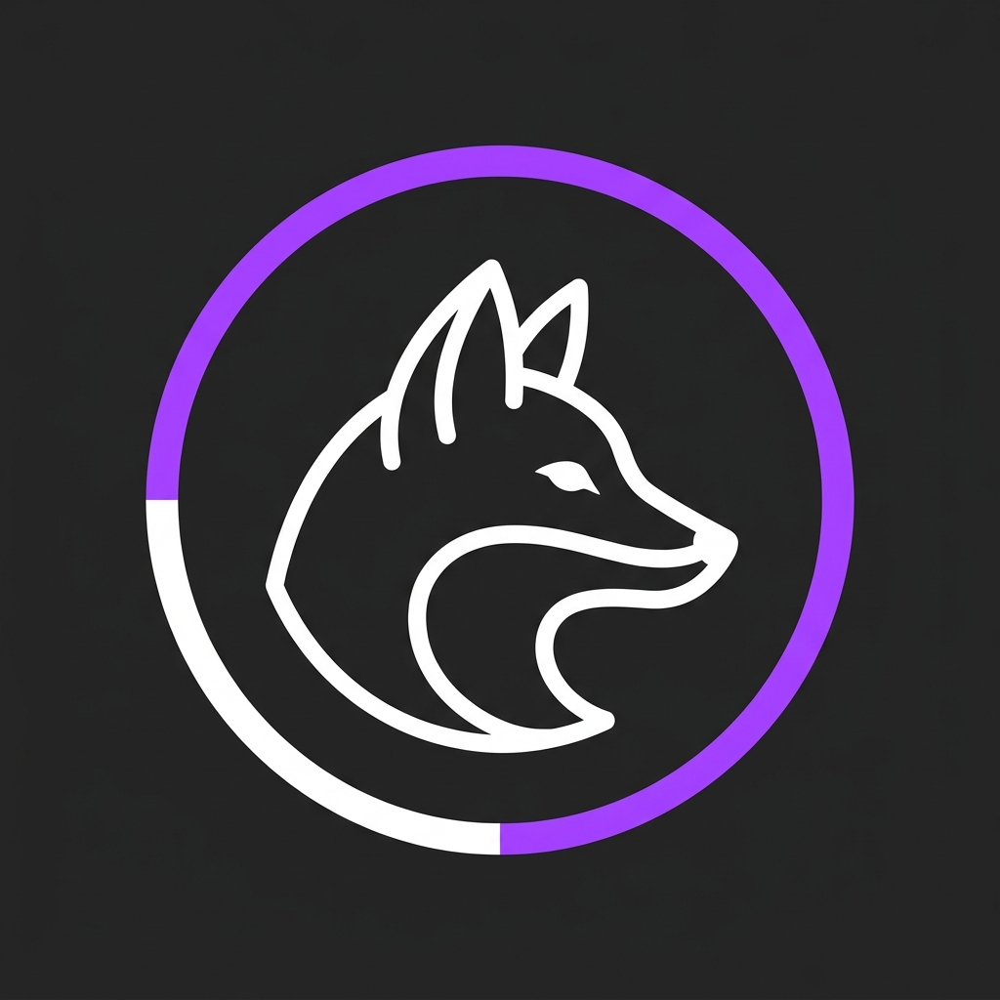

# AeroFox 🦊

A modern, minimalist Android-inspired brand identity and interactive logo playground, styled after the Antigravity design language.



## Features

- **Split-Color Ring Badge**: Dynamic geometry that divides the enclosing ring into an accent-colored arc and a base stroke.
- **Sleek Vector Line-Art**: Scalable, clean line-art profile of a fox head.
- **Interactive Sandbox Customizer**: 
  - Dynamic accent color switcher.
  - Live stroke-weight adjusting.
  - Midnight Dark and Alabaster Light theme toggles.
  - Interactive SVG radial glow toggle.
- **Export SVG**: Download your customized vector configuration instantly.
- **Responsive Layout**: Designed for high-fidelity viewing across all modern devices.

## Project Structure

```text
├── index.html                  # Structure & HTML layout
├── style.css                   # Glassmorphic UI & responsive styling
├── script.js                   # Interactive customizer controls & SVG export
├── README.md                   # Repository documentation
├── walkthrough.md              # Design walkthrough and summaries
└── vixen_fox_logo_1782631615289.jpg # Generated brand asset
```

## Quick Start

Simply open the `index.html` file in any modern web browser to run the interactive sandbox:

```bash
# Windows
start index.html

# macOS
open index.html

# Linux
xdg-open index.html
```

---
*Created as part of the Antigravity system.*
